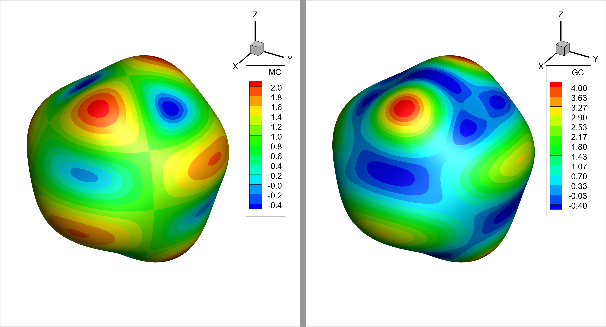

# CURVPACK

A set of routines to calculate curvature and Laplace-Beltrami operation on manifold triangular-element surface meshes. 

Includes a icosahedron based spherical surface mesh generator with quadratically increasing refinement (as opposed to exponential increase from subdivision methods). 

Six different curvature calculation algorithms and two different Laplace-Beltrami calculation algorithms are included. Examples 4 and 5 shows the rate of convergence convergence in curvature calculation. 

The figure shows the mean curvature (MC) and Gaussian curvature (GC) on a spherical surface surface perturbed by $ Y^{2}_{5}$ spherical harmonic. See Example 1.

The following methods are implemented for curvature:

1. curvature1: [Guoliang Xu, Applied Numerical Mathematics 69 (2013) 1–12](<https://www.sciencedirect.com/science/article/pii/S0168927413000184>). Quadratic approximation of all three coordinates.
2. curvature2: [S. Rusinkiewicz 2004](<https://ieeexplore.ieee.org/abstract/document/1335277>)
3. curvature3: [Goldfeather & Interrante](<https://dl.acm.org/citation.cfm?id=966134>)
4. curvature4: [Garimella and Schwartz](<http://citeseerx.ist.psu.edu/viewdoc/summary?doi=10.1.1.472.9458>). Local quadric fitting using two ring neighborhood around each vertex
5. curvature5: Local quadric fitting using one ring vertices and their normals.
6. curvature6: Local quadric fitting using two ring vertices and normals.

Use the any  of 1-4 that work for you.  I wrote 5 and 6 just out of curiosity to see what happens. They don't seem to work that great in general. 

Laplace Beltrami methods:

1. curvature1: curvature1 with `want_LB=True` calculates Laplace-Beltrami of the curvature.

2. LB1:[Guoliang Xu 2004](<https://ieeexplore.ieee.org/document/1290041>)
